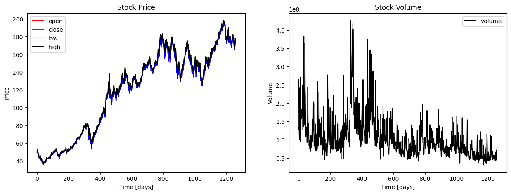

# Predicting Stock Market with RNN

In this repository, I have implemented RNN for stock prediction of various top companies. The dataset was used from YahooFinance.
______
For your ease the dataset can be found in the data folder. There are the csv files for the companies:
- Meta
- Tesla
- Google
- Apple
- Netflix
_____
*I have implemented a basic RNN on the stock of apple only but preprocessed the data, performed feature engineering for all the five datas. You can try with other dataset yourself.*

## Following are the some of the plots

**Stock and Volume of Apple**

**Stock Prices of Apple**

